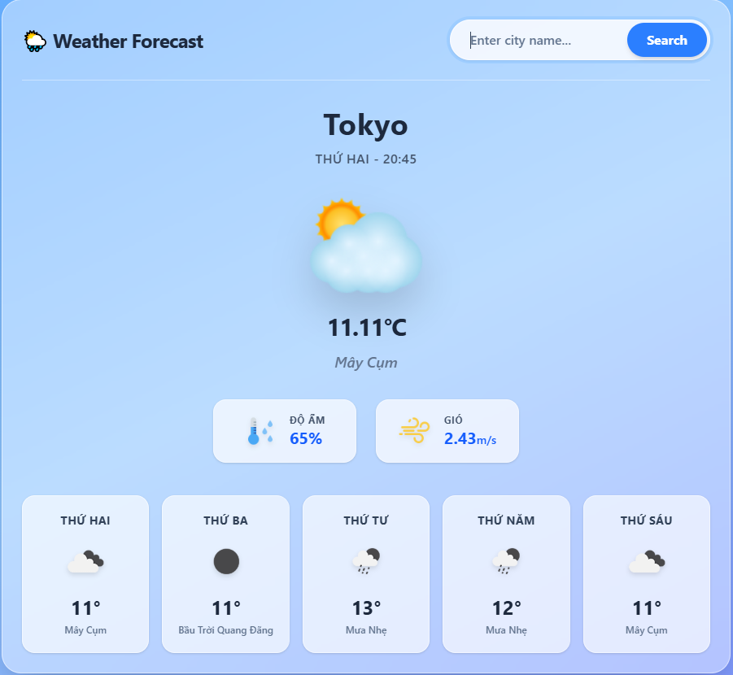

# Weather App Project - Learning Basic React

Hello! This is the **Weather App** project that I am doing to learn React. This project helps me practice basic concepts like state management, API calls, and component-based structure in React.

## Project Description

A simple weather app that lets users search for current weather and a 5-day forecast for any city. Data is taken from the OpenWeatherMap API.

## Main Features

-   **Weather Search**: Enter a city name to see current weather (temperature, humidity, wind).
-   **5-Day Forecast**: Shows daily weather forecast with temperature and description.
-   **Error Handling**: Shows a message if the city is not found.

## Technologies Used

-   **React**: Main framework to build the UI.
-   **Vite**: Fast build tool for development.
-   **Axios**: Library to call APIs.
-   **Tailwind CSS**: CSS framework for styling.
-   **OpenWeatherMap API**: Source of weather data.

## Screenshot



---

## How to Install and Run

1. **Clone the repo** (if available):

    ```
    git clone <repo-url>
    cd weather-app
    ```

2. **Install dependencies**:

    ```
    npm install
    ```

3. **Set up API key**:

    - Create a `.env` file in the root folder.
    - Add: `VITE_OPENWEATHER_API_KEY=your_api_key_here`
    - Get the API key from [OpenWeatherMap](https://openweathermap.org/api).

4. **Run the app**:
    ```
    npm run dev
    ```

## How to Use

-   Enter a city name (like "Hanoi") in the search box.
-   Press Enter or click to see the weather.
-   View the 5-day forecast below.

## What I Learned from This Project

-   **React Hooks**: Using `useState` to manage state (weather, forecast).
-   **API Integration**: Calling APIs asynchronously with `axios` and handling JSON data.
-   **Component Structure**: Breaking down the UI into components (SearchBox, WeatherCard, ForecastList).
-   **Error Handling**: Using try-catch to handle API errors.
-   **Environment Variables**: Storing API key safely with environment variables.
-   **Responsive Design**: Using Tailwind for responsive UI.
